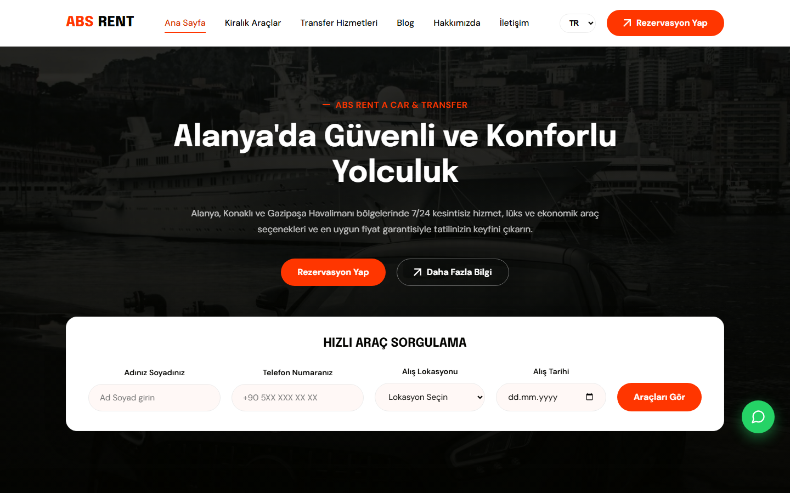
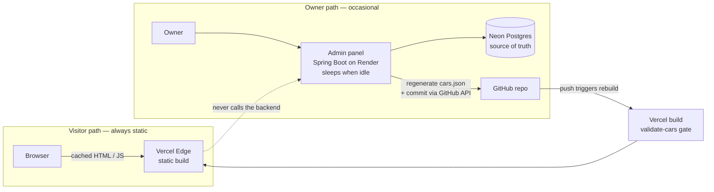
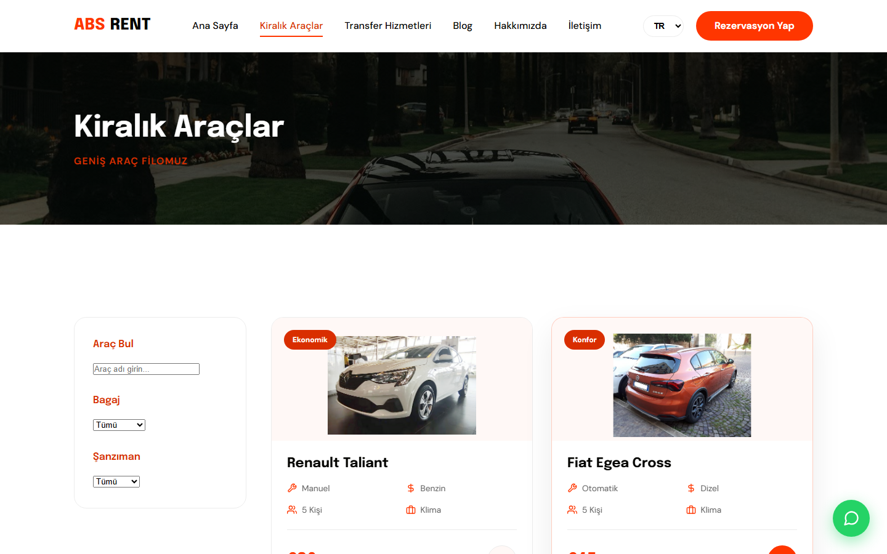
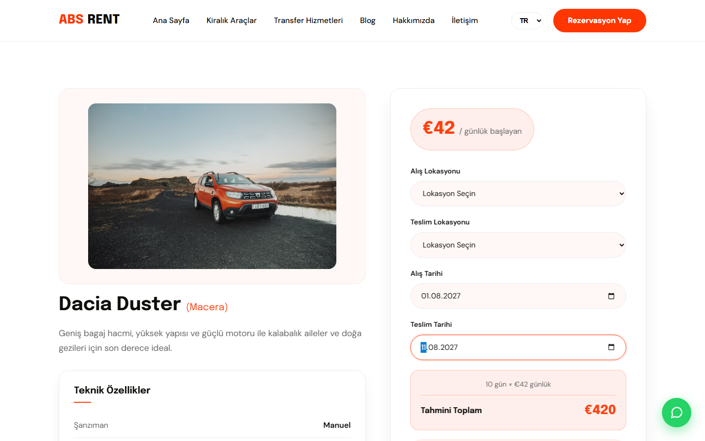
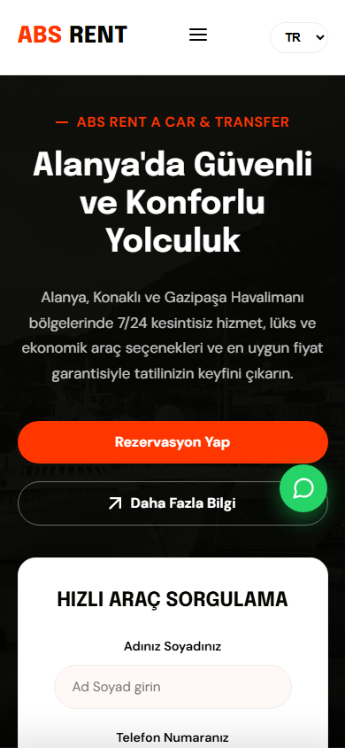

# ABS Rent A Car & Transfer

[](https://github.com/YusufKosarDev/abs-rentacar/actions/workflows/ci.yml)

Production website for a car rental and airport transfer company operating in Alanya,
Konaklı and the Gazipaşa / Antalya airport corridor on the Turkish Mediterranean coast.

**Live:** <https://abs-rentacar.com>



---

## Overview

A freelance project delivered end to end: design, implementation, multilingual content,
SEO, deployment, and a self-service admin panel that lets the non-technical owner change
prices and fleet without touching code.

The business has no booking back office and no payment processor. Every reservation is
confirmed by a human over WhatsApp. That single fact shaped the visitor site: no server,
no database and no session state on the critical path — a statically generated multi-page
app whose job is to present the fleet accurately, compute honest price estimates in the
browser, and route the visitor toward a WhatsApp reservation for a chosen vehicle.

The interesting part is what sits *behind* that static site: a separate admin panel that
edits the data and republishes the site, **without the visitor experience ever depending
on it**. That tension — self-service editing versus a zero-backend visitor path — is the
core design problem, described below.

---

## Architecture: a static site with a self-service admin panel

The requirement was that the owner update prices and availability alone, while the public
site stayed as fast and robust as a static build. Wiring the visitor pages to fetch from a
backend at runtime was rejected outright: the admin backend runs on a free tier that sleeps
when idle, so a cold start of tens of seconds would sit on the customer's critical path —
a lost booking every time the service had gone to sleep.

The chosen pattern keeps data flowing **through the build, not through a request**:



The owner edits in the panel → the panel writes to Postgres → it regenerates `cars.json`
and commits it to this repository through the GitHub Contents API → the push triggers a
Vercel rebuild → the change is live in roughly a minute. The visitor site is a plain static
build the whole time. **If the admin backend is asleep, broken or deleted, the public site
serves exactly as before** — the backend is on the publish path, never the read path.

Two consequences fall out of this for free:

- The build's `validate-cars` schema check (below) runs on every publish, so a malformed
  edit fails the build and the previous good site stays live — the panel cannot corrupt
  production.
- The admin backend lives in a **separate, private repository**
  (`abs-rentacar-admin`, Spring Boot + Postgres) precisely so its deploys can never touch
  this site's build. That repo carries its own architecture and security write-up.

---

## Engineering highlights

### Single-source site URL

The canonical origin appeared **58 times across 17 files** — canonical tags, `og:url`,
`hreflang` pairs, JSON-LD, `sitemap.xml`, `robots.txt` and three build scripts. Migrating
to a custom domain would have meant 58 correct edits with no safety net, and any miss
silently breaks SEO rather than the build.

It now lives in one place:

```js
// site.config.js
export const SITE_URL = 'https://abs-rentacar.com';
```

Markup and public text files carry a `__SITE_URL__` placeholder. A small Vite plugin
resolves it through `transformIndexHtml` during build *and* dev, rewrites the copies of
`robots.txt` / `sitemap.xml` that Vite passes through verbatim, and serves the substituted
version through dev-server middleware so local output matches production. The generator
and link-check scripts import the same constant. The actual domain migration was a
two-line diff.

### A build that fails loudly instead of shipping quietly

A placeholder that never gets substituted produces a page that renders perfectly and is
wrong only in its metadata — exactly the class of defect that no test catches and no one
notices for months. The last step of the build walks `dist/` and exits non-zero if any
unresolved `__SITE_URL__` survives, naming the offending files. Verified with a deliberate
negative test, not assumed.

The same philosophy guards fleet data: `validate-cars.mjs` runs **first** in the build
chain and rejects a malformed `cars.json` (missing field, bad type, invalid price tier,
duplicate id, off-list vehicle category) before anything is generated — and, as above, this
is what makes the admin publish flow safe.

### Multilingual architecture

Eleven languages are offered. Four (**TR, EN, DE, RU**) are hand-translated through a
dictionary in `src/i18n/translations.js`; the remaining seven are handled by Google
Translate for long-tail visitors.

The four curated languages are not a client-side toggle. After the Vite build, a generator
walks the compiled Turkish pages and emits real static routes under `/en/`, `/de/` and
`/ru/` — translated copy, translated `<title>` and meta description, correct `<html lang>`
and `og:locale`, language-scoped internal links, and a `hreflang` cluster wiring all four
variants plus `x-default`.

This matters because crawlers index URLs, not localStorage. A JavaScript language switcher
produces one indexable page; static routes produce four, each ranking in its own market.
Per-page `canonical` and `og:url` are both localised — they must agree, or a shared `/de/`
link previews as the Turkish homepage.

### Static SEO pages per vehicle

Fourteen vehicles each get a pre-rendered page in Turkish and English (`/arac/<id>.html`,
`/en/arac/<id>.html`) with a spec table, the full tiered price list and `Product` JSON-LD.
These are generated at build time from `cars.json` by reusing the compiled page shell, so
the header, footer and hashed asset references never drift from the rest of the site. The
sitemap grows to **57 URLs** without anyone maintaining it by hand.

### Quick-search that funnels instead of dead-ends

The homepage quick-search form used to compose a WhatsApp message directly. It now routes
to the fleet page, carrying the chosen pickup location and date as query parameters that
propagate through the vehicle links into the price calculator on the detail page — so a
visitor lands on a specific car with the calculator pre-filled, and the WhatsApp handoff
happens from a concrete vehicle rather than an empty enquiry. The routing logic is a pure,
unit-tested module (`src/lib/booking-params.js`).

### Link and asset health scanning

`scripts/check-links.mjs` crawls the live site — every page, every internal link, every
vehicle image, every generated route — and exits non-zero on the first broken resource. An
earlier version only matched one hostname pattern, which let a hot-linked third-party image
sit undetected; the scan now covers every off-origin absolute URL, including the Wikimedia
attribution links in the legal page — a dead attribution link is a licence-compliance
problem, not just a broken anchor. Every vehicle photograph is self-hosted and attributed
on `/legal.html`.

---

## Fleet and price calculator



Vehicles filter by segment, transmission and free-text search on the client. Each detail
page runs a tiered price calculator in the browser: pick a date range, get the correct
per-tier daily rate and total — the maths that turns into a customer dispute if it is wrong,
so it is the most heavily unit-tested part of the codebase.



The fleet is browsed mostly on phones on variable holiday-season networks, so the layout is
mobile-first throughout:



---

## Testing and CI

| Layer | Tool | Coverage |
|---|---|---|
| Unit — 38 tests | Vitest | Tiered pricing maths, fleet filter combinations, CSV parsing, booking-param routing |
| E2E — 24 tests | Playwright | Fleet rendering, filters, price calculator, static `/en/` `/de/` `/ru/` output, language switching, quick-search routing, WhatsApp deep links |
| Accessibility | axe-core | Zero critical violations on home, fleet and contact |
| Performance | Lighthouse CI | Audited on every code change |

CI is split by change type so the admin panel's frequent data-only publishes stay cheap:

- **`ci.yml`** (always) — lint, unit tests and a full build (which includes the
  `validate-cars` gate). Runs on every commit, including cars.json publishes.
- **`ci-heavy.yml`** (`paths-ignore: src/data/cars.json`) — Playwright E2E and Lighthouse.
  Runs when code, templates or styles change; **skipped** for data-only publish commits,
  because re-running a browser suite and a Lighthouse audit on a price change wastes CI
  minutes without adding protection.

Pricing is the part worth testing hardest: a wrong daily rate is a customer dispute, not a
rendering glitch.

---

## Delivery and security

Deployed on Vercel from `main`. `vercel.json` sets a strict Content Security Policy plus
HSTS with preload, `X-Frame-Options: DENY`, `nosniff`, a restrictive `Permissions-Policy`
and a one-year immutable cache for images. Fonts are self-hosted through `@fontsource`
rather than fetched from a third-party CDN.

Contact and newsletter forms carry three layers of spam protection — a honeypot field, a
minimum time-to-submit check and a JavaScript challenge — before composing the WhatsApp
message.

---

## Tech stack

| Layer | Choice |
|---|---|
| Build | Vite 8.1.5 — multi-page, 12 HTML entry points |
| Frontend | Vanilla JavaScript, no framework |
| Carousel | Swiper 14.0.5 |
| Fonts | Epilogue + DM Sans, self-hosted via `@fontsource` |
| Testing | Vitest 4.1.10, Playwright 1.61.1, axe-core |
| Quality | ESLint 10.7.0, Prettier, Lighthouse CI |
| Hosting | Vercel — push to `main` deploys |
| Data | `src/data/cars.json`, published from the admin panel (see below) |

No framework was used because nothing here needs one: there is no client-side routing, no
shared mutable state and no server rendering to reconcile. Adding React would have added a
runtime and a build surface to a site whose interactivity is a filter list, a date-range
calculator and a carousel.

---

## The admin panel

Fleet and price data is edited in a companion Spring Boot application that publishes to
this repository (the architecture section above). It is a **separate, private repository**
— `abs-rentacar-admin` — kept private because it holds the deploy pipeline, not because the
code is secret; it has its own README covering session auth, brute-force protection, the
GitHub Contents API publish flow and its honest limitations.

`src/data/cars.json` in this repo is the published artefact of that pipeline. It can still
be hand-edited in a pinch (a commit rebuilds the site), and `src/sheets.js` retains an
optional Google Sheets overlay as an alternative low-tech path — implemented, documented,
left inactive by default.

---

## Getting started

```bash
npm install          # also points core.hooksPath at .githooks
npm run dev          # dev server on localhost:5173
npm run build        # production build into dist/
npm run preview      # serve the build locally
```

Build chain: `validate-cars` → `vite build` → `generate-en-pages` → `generate-car-pages`.
Data validation runs first so a malformed `cars.json` fails before anything is generated.

```bash
npm test             # 38 unit tests
npm run test:e2e     # 24 E2E + accessibility tests
npm run lint
node scripts/check-links.mjs   # scan the live site
```

To move the site to a different domain, change one line in `site.config.js` and push. Every
canonical tag, `og:url`, `hreflang`, JSON-LD URL, sitemap entry and `robots.txt` directive
follows, and the build guard fails if anything is left behind.

---

## Trade-offs

Decisions made knowingly, that would change with different requirements:

- **No backend on the visitor path.** Reservations go through WhatsApp because that is how
  the business operates. If online payment were ever required, this becomes the wrong shape.
- **Data published through a commit, not a live API.** The admin panel edits Postgres and
  commits `cars.json`, trading ~1 minute of publish latency for a visitor site that never
  depends on a running backend. For a fleet that changes a few times per season, that trade
  is heavily in the site's favour.
- **Google Translate for seven of eleven languages.** Curated translations for the four
  markets that matter commercially; machine translation for the tail. Honest coverage beats
  eleven mediocre dictionaries.
- **Vanilla JavaScript in one main module.** Fine at this size. Past roughly twice the
  current surface it would want splitting into modules with real boundaries.

---

Built and maintained by [YusufKosarDev](https://github.com/YusufKosarDev).
