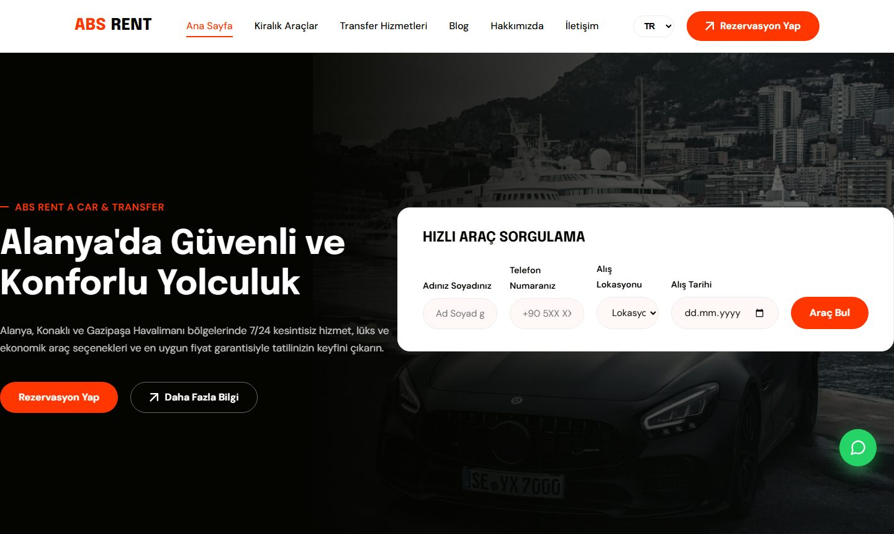

# ABS Rent A Car & Transfer

[](https://github.com/YusufKosarDev/abs-rentacar/actions/workflows/ci.yml)

Alanya, Konaklı ve Gazipaşa / Antalya havalimanı hattında hizmet veren bir araç kiralama
ve VIP transfer firmasının kurumsal web sitesi.

**Canlı:** <https://abs-rentacar.com> · **English:** [README.md](README.md)



---

## Genel bakış

Tasarımdan yayına kadar uçtan uca teslim edilmiş bir freelance proje: arayüz, geliştirme,
çok dilli içerik, SEO, deploy ve özel domain kurulumu.

Firmanın rezervasyon paneli ve ödeme altyapısı yok; her rezervasyon WhatsApp üzerinden bir
insan tarafından onaylanıyor. Mimarinin tamamını bu tek gerçek belirledi: sunucu yok,
veritabanı yok, oturum durumu yok. Site statik olarak üretilen çok sayfalı bir uygulama;
görevi filoyu doğru sunmak, tarayıcıda dürüst fiyat tahmini hesaplamak ve WhatsApp'a hazır
bir mesaj devretmek.

Statik tercihi tesadüf değil, bilinçli bir karardı. İçerik sezonda birkaç kez değişiyor,
trafik mevsimsel ve ağırlıklı olarak değişken mobil şebekelerden geliyor, işletmeci ise
teknik değil. CDN kenarından sunulan statik bir build; işletmesi en ucuz, yüklenmesi en
hızlı ve kendi haline bırakıldığında bozulma ihtimali en düşük seçenek.

---

## Öne çıkan mühendislik kararları

### Tek kaynaktan site adresi

Kanonik adres **17 dosyada 58 kez** geçiyordu — canonical etiketleri, `og:url`, `hreflang`
çiftleri, JSON-LD, `sitemap.xml`, `robots.txt` ve üç build scripti. Özel domaine geçiş, hiç
güvenlik ağı olmadan 58 doğru düzenleme demekti; atlanan her biri build'i kırmak yerine
SEO'yu sessizce bozardı.

Artık tek yerde:

```js
// site.config.js
export const SITE_URL = 'https://abs-rentacar.com';
```

Markup ve public metin dosyaları `__SITE_URL__` yer tutucusunu taşıyor. Küçük bir Vite
eklentisi bunu build **ve** dev sırasında `transformIndexHtml` ile çözüyor, Vite'ın olduğu
gibi kopyaladığı `robots.txt` / `sitemap.xml` çıktılarını yeniden yazıyor ve dev sunucusunda
middleware üzerinden değiştirilmiş sürümü sunuyor — böylece yerel çıktı üretimle örtüşüyor.
Üretim ve tarama scriptleri de aynı sabiti import ediyor.

Gerçek domain geçişi iki satırlık bir diff oldu.

### Sessizce yayınlamak yerine gürültüyle kırılan build

Çözülmeyen bir yer tutucu, kusursuz görünen ama meta verisi yanlış olan bir sayfa üretir —
tam olarak hiçbir testin yakalamadığı ve aylarca fark edilmeyen hata sınıfı.

Build'in son adımı `dist/` dizinini tarıyor ve çözülmemiş bir `__SITE_URL__` kalırsa sorunlu
dosyaları adlarıyla bildirip sıfırdan farklı kodla çıkıyor. Varsayılmadı; kasıtlı bir negatif
testle doğrulandı.

### Çok dilli mimari

On bir dil sunuluyor. Dördü (**TR, EN, DE, RU**) `src/i18n/translations.js` içindeki sözlükle
elle çevrildi; kalan yedisi uzun kuyruk ziyaretçiler için Google Translate ile karşılanıyor.

Elle çevrilen dört dil istemci tarafında bir açma/kapama düğmesi değil. Vite build'inden
sonra bir üretici, derlenmiş Türkçe sayfaları gezip `/en/`, `/de/` ve `/ru/` altında gerçek
statik route'lar üretiyor: çevrilmiş metin, çevrilmiş `<title>` ve açıklama, doğru
`<html lang>` ve `og:locale`, dil kapsamında iç linkler, dört varyantı ve `x-default`'ı
birbirine bağlayan `hreflang` kümesi.

Bu önemli çünkü arama motorları localStorage'ı değil URL'leri indeksler. JavaScript ile dil
değiştiren bir site tek indekslenebilir sayfa üretir; statik route'lar dört tane üretir ve
her biri kendi pazarında sıralanır.

Sayfa başına `canonical` ve `og:url` birlikte yerelleşiyor — ikisi uyuşmazsa paylaşılan bir
`/de/` linki önizlemede Türkçe ana sayfayı gösterir.

### Araç başına statik SEO sayfaları

On dört aracın her biri için Türkçe ve İngilizce önceden üretilmiş sayfa
(`/arac/<id>.html`, `/en/arac/<id>.html`): teknik özellik tablosu, kademeli fiyat listesi ve
`Product` JSON-LD. Bunlar build sırasında `cars.json`'dan, derlenmiş sayfa kabuğu yeniden
kullanılarak üretiliyor; böylece header, footer ve hash'li asset referansları sitenin geri
kalanından hiç ayrışmıyor.

Sitemap kimse elle bakım yapmadan **57 URL**'ye çıkıyor.

### Link ve kaynak sağlık taraması

`scripts/check-links.mjs` canlı siteyi tarıyor — her sayfa, her iç link, her araç görseli,
her üretilmiş route — ve ilk kırık kaynakta sıfırdan farklı kodla çıkıyor. CI'da haftalık
çalışıyor.

Önceki sürümü yalnızca tek bir ana makine desenini eşleştiriyordu; bu yüzden transfer
sayfasındaki üçüncü taraf bir hotlink görseli fark edilmeden kalmıştı. Tarama artık tüm dış
mutlak adresleri kapsıyor — yasal sayfadaki Wikimedia atıf bağlantıları dahil: ölü bir atıf
linki yalnızca kırık bir bağlantı değil, lisans uyum sorunudur.

Tüm araç fotoğrafları self-host ediliyor ve `/legal.html` sayfasında atıflandırılıyor.

### Test

| Katman | Araç | Kapsam |
|---|---|---|
| Birim — 28 test | Vitest | Kademeli fiyat matematiği, filtre kombinasyonları, CSV ayrıştırma |
| E2E — 16 test | Playwright | Filo render, filtreler, fiyat hesaplayıcı, statik route'lar, `/en/` `/de/` `/ru/` çıktısı, dil değiştirme, WhatsApp linkleri |
| Erişilebilirlik | axe-core | Ana sayfa, filo ve iletişimde sıfır kritik ihlal |

En sıkı test edilmesi gereken kısım fiyatlandırma: yanlış bir günlük ücret render hatası
değil, müşteri anlaşmazlığıdır.

### Yayın ve güvenlik

Vercel üzerinde `main` dalından yayınlanıyor. `vercel.json` sıkı bir Content Security Policy,
preload'lu HSTS, `X-Frame-Options: DENY`, `nosniff`, kısıtlayıcı `Permissions-Policy` ve
görseller için bir yıllık immutable önbellek tanımlıyor. Fontlar üçüncü taraf bir CDN'den
çekilmek yerine `@fontsource` ile self-host ediliyor.

İletişim ve bülten formları WhatsApp mesajını oluşturmadan önce üç katmanlı spam
korumasından geçiyor: honeypot alanı, minimum gönderim süresi kontrolü ve JavaScript
doğrulaması.

---

## Teknoloji

| Katman | Tercih |
|---|---|
| Build | Vite 8.1.5 — çok sayfalı, 12 HTML giriş noktası |
| Frontend | Vanilla JavaScript, framework yok |
| Slider | Swiper 14.0.5 |
| Harita | Leaflet 1.9 (SRI ile sabitlenmiş) |
| Font | Epilogue + DM Sans, `@fontsource` ile self-host |
| Test | Vitest 4.1.10, Playwright 1.61.1, axe-core |
| Kalite | ESLint 10.7.0, Prettier, Lighthouse CI |
| Barındırma | Vercel — `main`'e push ile deploy |
| Veri | `src/data/cars.json`, opsiyonel Google Sheets CSV katmanı |

Framework kullanılmadı çünkü burada hiçbir şey framework gerektirmiyor: istemci tarafı
yönlendirme yok, paylaşılan değişken durum yok, uzlaştırılacak sunucu render'ı yok. React
eklemek; etkileşimi bir filtre listesi, bir tarih aralığı hesaplayıcısı ve bir slider'dan
ibaret olan bir siteye runtime ve build yüzeyi eklemek olurdu.

---

## Proje yapısı

```
├── index.html                    # Ana sayfa
├── cars.html                     # Filo + filtreler
├── car-details.html              # Araç detayı (?id=)
├── transfer.html                 # Havalimanı transfer hizmetleri
├── about.html · contact.html     # Kurumsal, iletişim formu + harita
├── blog.html · legal.html        # Rehber yazıları; KVKK, gizlilik, foto kaynakları
├── 404.html
├── *-arac-kiralama.html          # SEO landing (Antalya, Gazipaşa, Konaklı)
│
├── site.config.js                # SITE_URL — tek kaynak
├── vite.config.js                # Çok sayfalı build + SITE_URL eklentisi
├── vercel.json                   # Güvenlik başlıkları, önbellek politikası
│
├── src/
│   ├── main.js                   # Site mantığı: i18n, render, rezervasyon akışı
│   ├── sheets.js                 # Opsiyonel Google Sheets fiyat katmanı
│   ├── i18n/translations.js      # TR / EN / DE / RU sözlükleri
│   ├── lib/                      # pricing.js, filters.js — birim testli
│   ├── data/cars.json            # Filo verisi, build'de şema doğrulamalı
│   └── css/                      # style.css (tasarım sistemi) + animations.css
│
├── scripts/
│   ├── validate-cars.mjs         # Şema doğrulama — ilk çalışır
│   ├── generate-en-pages.mjs     # Statik /en/, /de/, /ru/ route'ları
│   ├── generate-car-pages.mjs    # Araç başına SEO sayfaları + build guard
│   └── check-links.mjs           # Canlı link ve kaynak taraması
│
├── tests/                        # Vitest birim + Playwright E2E
└── .githooks/                    # Versiyonlanmış git hook'ları
```

`/en/`, `/de/`, `/ru/` ve `/arac/` depoda tutulmaz — build çıktısıdır.

---

## Başlangıç

```bash
npm install          # core.hooksPath değerini .githooks olarak da ayarlar
npm run dev          # geliştirme sunucusu, localhost:5173
npm run build        # dist/ altına production build
npm run preview      # build'i yerelde sun
```

Build zinciri: `validate-cars` → `vite build` → `generate-en-pages` → `generate-car-pages`.
Veri doğrulaması ilk çalışır; böylece bozuk bir `cars.json` hiçbir şey üretilmeden hata verir.

### Kalite kontrolleri

```bash
npm test             # 28 birim test
npm run test:e2e     # 16 E2E + erişilebilirlik testi
npm run lint
npm run format
node scripts/check-links.mjs   # canlı siteyi tara
```

---

## Yayın

`main`'e yapılan push'lar otomatik olarak Vercel'e deploy edilir. CI her push ve pull
request'te lint, birim testler, tam build, Playwright E2E ve Lighthouse denetimi çalıştırır.

Siteyi başka bir domaine taşımak için `site.config.js`'te tek satırı değiştirip push etmek
yeterli. Tüm canonical etiketleri, `og:url`, `hreflang`, JSON-LD adresleri, sitemap girdileri
ve `robots.txt` yönergeleri bunu takip eder; geride bir şey kalırsa build guard hata verir.

---

## Ödünleşimler

Bilinçli olarak verilmiş, farklı gereksinimlerde değişecek kararlar:

- **Backend yok.** Rezervasyonlar WhatsApp üzerinden ilerliyor çünkü işletme fiilen böyle
  çalışıyor. Online ödeme gerekseydi bu yapı yanlış tercih olurdu.
- **Fiyatlar JSON dosyasında.** Değiştirmek commit gerektiriyor. `src/sheets.js`, yayınlanmış
  bir Google E-Tablosundan fiyat ve müsaitlik bilgisini üzerine bindirebiliyor; böylece
  teknik olmayan bir işletmeci kendi güncelleyebilir. Yazıldı ve belgelendi, varsayılan
  olarak kapalı bırakıldı.
- **On bir dilin yedisi Google Translate.** Ticari olarak önemli dört pazar için elle çeviri,
  kuyruk için makine çevirisi. Dürüst kapsam, on bir vasat sözlükten iyidir.
- **Tek ana modülde vanilla JavaScript.** Bu ölçekte sorun değil. Mevcut yüzeyin kabaca iki
  katına çıkarsa gerçek sınırları olan modüllere bölünmeyi ister.

---

[YusufKosarDev](https://github.com/YusufKosarDev) tarafından geliştirildi.
